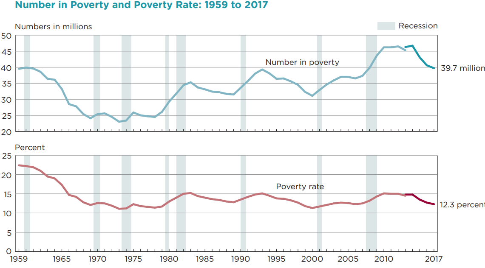
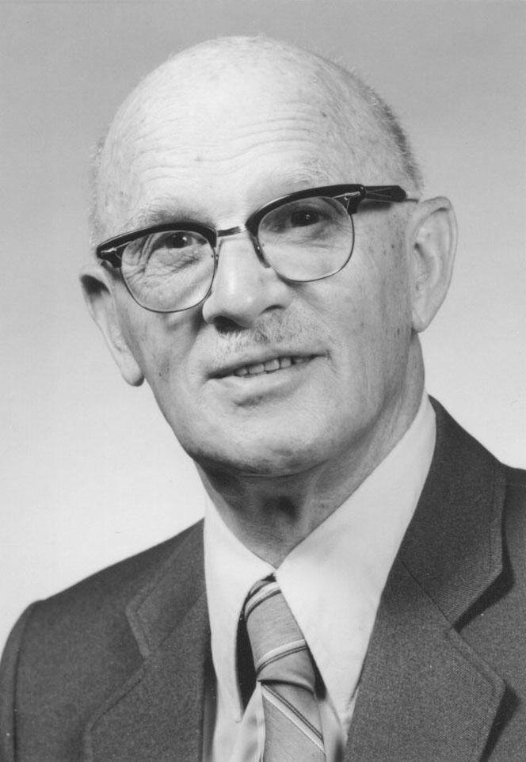
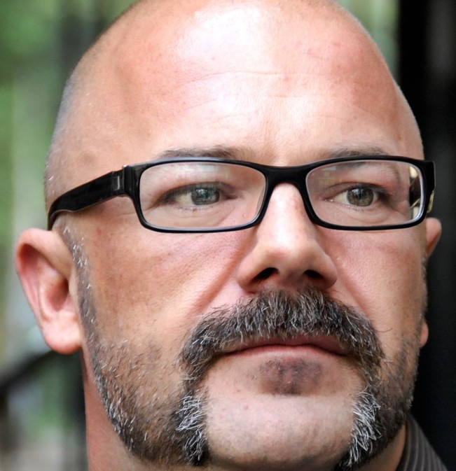
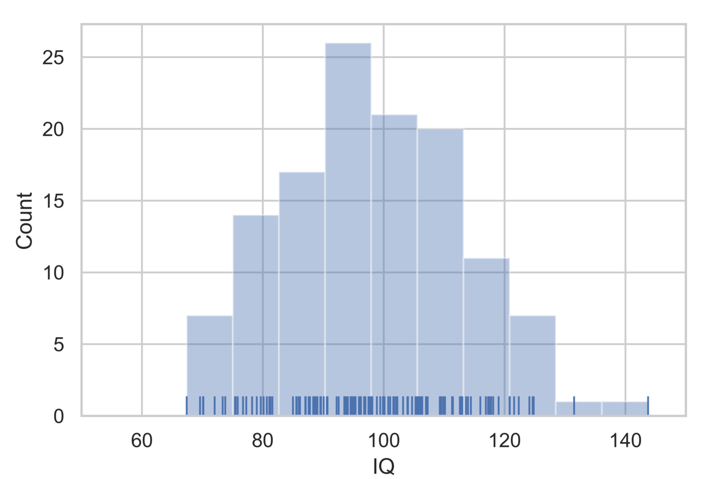
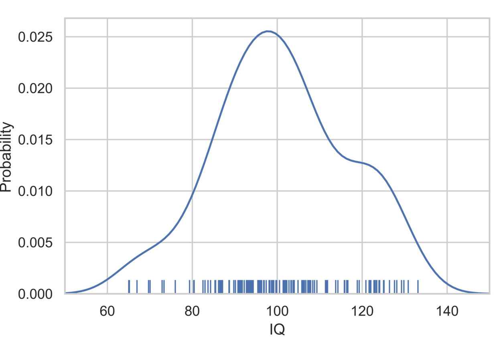
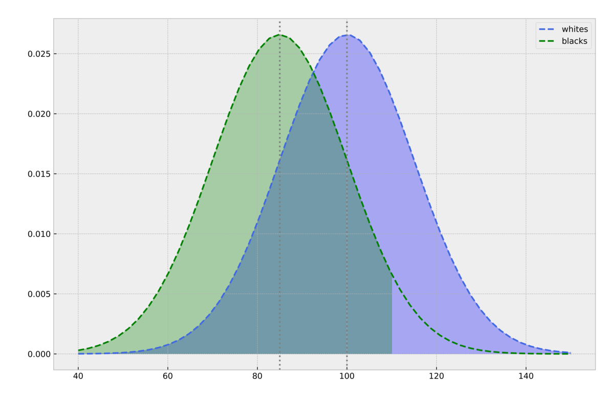

Have you read *The Rise of the Colored Empires* by this man Goddard?... It's a fine book and everybody ought to read it. The idea is if we don't look out the white race will be---will be utterly submerged. *It's all scientific stuff; it's been proved.* --- This idea is that we're Nordics...and we've produced all the things that go to make civilization -- oh, science and art and all that. Do you see? 

[--- **Tom Buchanan** (fictional character), *The Great Gatsby*]{style="float:right"}

|
|

Something that's eventually going to come out here is this: right beneath the surface this whole Black-White deal is going to come out the fact that Asians are capable of governing themselves one way or another; we Caucasians have learned it after slaughtering each other in religious wars and other wars for many many years; the Latins do it, in a miserable way but they do it; *but the Africans just can't run things; that's a very very fundamental point*....but when you get to the shall we say --- some of the more profound, rigid disciplines --- *basically they (Blacks) have a hell of a time making it* ... Let me tell you what my theory is after all this. *My theory is that the responsibility of a President is to know these things; but also my theory is that I must do everything that I possibly can to deny them.*^[Nixon talking about IQ tests and other things, https://www.youtube.com/watch?v=PwXOEFK6Swo&t=995s] 

[--- **President Richard Nixon**, *White House Phone Conversation 1971*]{style="float:right"}

|
|

*A large majority of Blacks (more than 60\%) suffers from a mental disability of major proportions*. The disability is on par with serious physical disabilities and **disqualifies** them from succeeding in a modern society except for holding the most menial jobs. *The mental disability is also a moral disability:* it *causes* the Black underclass to commit crimes, stay on welfare, engage in bad parenting, and remain uneducated at a much higher rate than the White population. The Black underclass also reproduces at a much higher rate than the average White, thus passing on their **bad genes** to the next generation. *It's simply a bad idea for most Blacks to have children. Are we willing to say this? We must say it.* If they were to decide not to have children, we would **admire and applaud** them for their decision. They will have made the **right decision** and the **morally correct one** not to reproduce. *We are not racists*. In our estimation, twenty-five percent (25\%) of Whites also suffer from the same disqualifying mental and moral disability. The White underclass should also not reproduce. *Our assessment is scientific and beyond significant technical dispute.*  We wrote *The Bell Curve* to call attention to the grave threat to a free society posed by the mentally and morally unfit.

[--- **Richard Herrnstein and Charles Murray**, *The Bell Curve*, (reconstructed quote)]{style="float:right"}

# Preamble

## The Jazz Age, The Tulsa Race Massacre, and the Rebirth of the Klu Klux Klan

I begin with three quotes. The first are the words of Tom Buchanan, a fictional character in  [F. Scott Fitzgerald's](https://en.wikipedia.org/wiki/F._Scott_Fitzgerald) novel [The Great Gatsby](https://en.wikipedia.org/wiki/The_Great_Gatsby). The setting of Fitzgerald's work is the [Jazz Age](https://en.wikipedia.org/wiki/Jazz_Age), a period after WWI which also saw the **rebirth** of the [Klu Klux Klan](https://en.wikipedia.org/wiki/Ku_Klux_Klan) (President Grant [crushed](https://www.historynet.com/grant-takes-klan.htm) the first incarnation during Reconstruction) and the [Great Migration](https://www.history.com/topics/black-history/great-migration) of Blacks from the rural South to the urban centers in the Northeast, Midwest, and West. Tom is a rich financier on Wall Street. He is described by Fitzgerald as having a "cruel body" which goes with a cruel mind and a cruel soul. Buchanan's assertion of White superiority, and the looming threat posed by Blacks and immigrants, is not an idle thought. It expresses the spirit of the Age. The sentiment resonated with ordinary citizens but also the most powerful figures of the time, including Teddy Roosevelt, Woodrow Wilson, and Oliver Wendell Holmes Jr. In 1915 President Wilson screened the epic film [Birth of a Nation](https://en.wikipedia.org/wiki/The_Birth_of_a_Nation) (originally called The Clansmen) at the White House. The Jazz Age was also the Age of the Tulsa Race Massacre, and the Rebirth of the Klu Klux Klan.

{width=20%}

## The Great Society and the Rise of IQ Studies

The second quote is drawn from a phone conversation between President Richard Nixon and  [Daniel Patrick Moynihan](https://en.wikipedia.org/wiki/Daniel_Patrick_Moynihan). *The year is 1971.* Lyndon Johnson's [Great Society Program](https://en.wikipedia.org/wiki/Great_Society#:~:text=The%20Great%20Society%20was%20a,to%20represent%20his%20domestic%20agenda.) began in 1965 with an ambitious goal of eradicating all poverty and social injustice. By 1969, poverty for Blacks had declined by more than 10 percentage points from 36\% to 24\%. For Whites poverty declined by 8 percentage points from 20\% to 12\%.^[https://en.wikipedia.org/wiki/Poverty_in_the_United_States] 

{width=60%}

By 1970, however, the Great Society began to lose momentum.  Escalation of the Vietnam began to redirect funds away from domestic programs to the war effort. Richard Nixon assumed the Presidency in 1969, having vowed, among other things, to roll back the "overreach" of the Great Society.^[https://www.history.com/topics/1960s/great-society] During this time the conservative backlash against the Great Society began to receive intellectual firepower with the publication of [Arthur Jensen's](https://en.wikipedia.org/wiki/Arthur_Jensen) (UC Berkeley) and [Richard Herrnstein's](https://en.wikipedia.org/wiki/Richard_Herrnstein) (Harvard) work on IQ.^[Jensen Arthur, (1969). How much can we boost IQ and scholastic achievement? Harvard Educational
Review 39, 1-123.] ^[Herrnstein, Richard. (1971) IQ in the Meritocracy. Atlantic Monthly]

> Jensen and Herrnstein suggested that there are likely to be **limits to equality** due to **inherent IQ differences** among the races.
 

Nixon's phone call with Moynihan occurs against this backdrop. Nixon has just read Richard Herrnstein's [article](https://cdn.theatlantic.com/assets/media/files/sept_1971_-_herrnstein_-_i.q..pdf) on IQ, which appeared in the [Atlantic](https://www.theatlantic.com/) in 1971. Atlantic's editors preface the article with the remark that the "albeit painful" discussion of race and intelligence is "important because **social legislation** (emphasis mine) must come to terms with **actual human potentialities** (emphasis mine), painful because the actualities are sometimes not what we vainly hope." In the course of the phone conversation it's clear that Nixon is thinking: 'Blacks are inferior to Whites and there are **hard limits** to what we can achieve with social policy and programs of the Great Society.' (**Note**: Moynihan was a staunch advocate of social justice and his views are complex. See Joel Klein's [recent piece](https://www.nytimes.com/topic/person/daniel-patrick-moynihan) in NY Times.)

## The Bell Curve as Intellectual Brutalism

The third quote from *The Bell Curve* is **not** an actual quote. It is a **reconstruction**. I have tried to distill into a single paragraph the upshot of *The Bell Curve's* view on race and intelligence. In this essay I hope to persuade the reader that *The Bell Curve's* views on race is even more radical than what is commonly supposed. 

>The Bell Curve is brutalism masquerading as science: a ideological blueprint for suppressing Blacks and the powerless of all races.

It will take several extended posts to  lay bare the *The Bell Curve*'s logic of brutality. Having said that, I believe TBC should be studied, not silenced. We learn from being exposed to bad ideas, not just good ones. Murray should be allowed to present his views freely. But he should also be pushed to speak in forums that promote real debate. *The Bell Curve* is wrong, but not obviously wrong. Until the nature of its errors are understood and exposed, it will continue to gain adherents.

(**Note**: An accessible version of TBC is in Murray's talk [The Bell Curve Revisited & Q&A](https://youtu.be/tNJYW2VfLw8). It's also one of the few moments when Murray lets his guard down and tells us exactly what he means. His views on "dysgenesis" and the problems associated with the "underclass" having too many children begins at 25:00. Most of the language I use in the reconstructed quote can be found in the YouTube video.)

{width=40%}

# Introduction

In a [previous post]() I summarized the argument of The Bell Curve (TBC) as a set of ten propositions. My primary objective in the series of posts is to evaluate TBC's *technical argument*, particulary its use of the National Longitudinal Survey of Youth 1979 ([NLSY79](https://www.bls.gov/nls/nlsy79.htm)) *dataset*. 

But before turning to the technical analysis proper (reserved for future posts), we need to work through a number of key concepts and distinctions. At this stage, our goal should be to *understand the argument* and *claims* of TBC. Our guide will be the maxim that the task of understanding precedes the task of criticism. 

# Controversy

*The Bell Curve* is *controversial* because it equates intelligence with IQ. But TBC is *doubly controversial* because of its view of race. 

A number of critics have dismissed TBC as racist pseudo-science.^[Graves Jr, Joseph L., and Amanda Johnson. "The pseudoscience of psychometry and the bell curve." Journal of Negro Education (1995): 277-294.] ^[Siegel, Eric. "The Real Problem wit Charles Murray and "The Bell Curve". Scientific American. April 12, 2017. https://blogs.scientificamerican.com/voices/the-real-problem-with-charles-murray-and-the-bell-curve/] ^[Turkheimer, Eric, Paige Harden, Kathryn, and Richard E. Nisbett. Charless Murray is once again peddling  junk science about race and IQ. https://www.vox.com/the-big-idea/2017/5/18/15655638/charles-murray-race-iq-sam-harris-science-free-speech] Academic scholars have found deep flaws but have mostly moved on, not because the subject matter of race and intelligence is "taboo", but from fatigue and exasperation. Even before the appearance of TBC, the eminent statistician and geneticist [Oscar Kempthorne](https://en.wikipedia.org/wiki/Oscar_Kempthorne) remarked that in discussions of the nature-nurture controversy "there is so much garbage interwoven with objective reasoning, that the reader can only be thoroughly perplexed. There have been 'gutter' polemics, emotional and irrational discourse to the extent that the rational portion of the scientific world tends to 'switch-off'."^[Oscar Kempthorne, Biometrics, Vol 34. No. 1 (Mar. 1978), pp. 1-23] 

{width=25%}

Kempthorne was writing in 1978, two decades *before* TBC. As an academic scholar of the first rank, Kempthorne did not "switch off". His invited paper in **Biometrics**, *Logical, Epistemological and Statistical Aspects of Nature-Nurture Data Interpretation* remains one of the best technical accounts of the abuses of IQ in hereditarian studies. Kempthorne's blistering tone is unusual for a scientific paper. He concludes the paper by noting that "mere observational studies **can easily lead to stupidities** (emphasis mine), and it is suggested that this has happened in the heredity-IQ arena." 
And "the making of unjustifiable assertions on inferiority of some races is obviously and naturally insulting, and our black population, for instance, is entitled to be very angry."^[Kempthorne, Ibid.] 

## Defenders of the Bell Curve Faith

If most academic scholars have "switched off", TBC continues to gain new adherents, particularly among a vanguard of influential internet intellectuals. 

In "A Tale of Two Bell Curves" ([Quillette,2017](https://quillette.com/)), Winegard and Winegard write, for example, that: "most of its (TBC) contentions are, in fact, **perfectly mainstream** and accepted by **most relevant experts**."^[Winegard, Bo and Ben Winegard. "A Tale of Two Bell Curves." March 27, 2017. https://quillette.com/2017/03/27/a-tale-of-two-bell-curves/] Winegard and Winegard's piece is well written and makes a strong case for a sympathetic reading of TBC. They conclude that there are "two versions of *The Bell Curve*. The first is a disgusting and bigoted fraud. The second is a judicious but provocative look at intelligence and its increasing importance in the United States. The first is a fiction. And the second is the real *Bell Curve*."

The well-known journalist and blogger Andrew Sullivan's adulation of Murray and TBC is well known. According to Sullivan, "The book...**still holds up** as one of the **most insightful and careful** of the last decade."^[Sullivan, Andrew. ]. As *The New Republic's* (TNR) editor in the early 1990s, Sullivan published excerpts from TBC along with a set of criticisms. Sullivan has continued to defend Murray fiercely: "Where I do draw the line is the attempt to **smear legitimate conservative ideas** and **serious scientific arguments** as the equivalent of peddling white supremacy and bigotry”.

{width=30%}

Sullivan approval of TBC as expressing "serious scientific arguments" is bizarre. He doesn't seem to have read the work. If he has, he has not absorbed TBC's core thesis when it comes to Blacks. In his exchange with Ta-Nehisi Coates, Sullivan writes: "No one is arguing 'that black people are dumber than white', **just** (emphasis mine) that the distribution of IQ is **slightly** (emphasis mine) different among different racial populations."^[Atlantic, November 28, 2011]. In statistics one standard deviation in IQ is not "slight", it's monumental. TBC doesn't argue that Blacks are dumber than Whites. Murray and TBC argue that Blacks are **substantially dumber** than Whites. TBC doesn't argue *just* that there is a slight difference in distributions. TBC's logic leads to the position that more than 60\% of Blacks **should not reproduce** because they carry bad genes. Sullivan also blithely severs the *explicit* connection between intellectual inferiority and moral inferiority in TBC: "For me, intelligence is a curse as well as a blessing --- and it has as much salience to my own sense of moral worth as my blood type." I will argue that in *The Bell Curve* intelligence and moral worth are **inextricably** linked. See **Proposition** 5 below.

> When it comes to race, *The Bell Curve's* core thesis is that Blacks are substantially (not slightly) inferior to Whites mentally, morally, and politically.

In a recent article in [Law and Liberty](https://lawliberty.org/), Helen Dale writes that "ordinary members of the public often think it’s (*The Bell Curve*) been debunked (**it hasn’t**))"^[Helen Dale, The Coming War over Intelligence. https://lawliberty.org/the-coming-war-over-intelligence/] Dale shares her experiences with having a "freakishly high" IQ. She goes on to advocate an arms race to research "the genetic basis of human inequality ... with honesty and rigour and humanity" since "the authoritarian states will get there first, and they have far fewer scruples." The direction is clear: since inequality is due primarily to genes and genes can be manipulated technologically, why not eliminate people with low IQ through selective breeding? "Molecular genetics is concerned with *what combination* of genes *cause* intelligence differences. As Richard Dawkins once commented, the problem with eugenics isn’t that it doesn’t work, but that it does."^[Helen Dale. Ibid.] Dale, "of course", does not advocate eliminating those with "low IQ" by **coercion**. Those with "high IQ", such as Dale, want to give those with "low IQ" the **choice** of altering their genes and the genes of their offspring. Richard Haier, editor-in-chief of the Journal Intelligence and Emeritus Professor of Psychology, writes: "If we can change environments or genes to increase IQ in individuals, we have a moral obligation to do so because more intelligence is better than less."^[https://quillette.com/2017/06/11/no-voice-vox-sense-nonsense-discussing-iq-race/] Murray also looks forward gleefully to the prospects of genetic alteration as a way of overcoming "dysgenesis", a state of affairs where the cognitive underclass reproduces at a much higher rate than the cognitive elite. 

Sam Harris, author and podcast host, has seized the mantle of TBC and is now one of its most ardent defenders. A neuroscientist by training, Harris has dedicated several podcasts on the topic. Harris states: "the most controversial passages in the book struck me as **utterly mainstream** with respect to the science at this point. They were mainstream at the time he wrote them and they’re **even more mainstream today.**"^[Making Sense Podcast #73 - Forbidden Knowledge. A Conversation with Charles Murray. April 22, 2017. https://samharris.org/podcasts/forbidden-knowledge/]  According to Harris, the main contentions of TBC are **"all facts"** and "there is almost nothing in psychological science for which there is more evidence than these claims."^[Harris podcast. #72. Forbidden Knowledge. https://samharris.org/podcasts/forbidden-knowledge/] 

{width=25%}

Harris also attacks TBC's critics as a malign force intent on *defamation* and *intimidation*: "I find the dishonesty and hypocrisy and moral cowardice of Murray's critics shocking." "One rarely encounters a fair reading of Murray. Whenever you see discusions of TBC you can be sure that the authors felt under immense pressure to dismiss it and they end up ignoring much of what Herrnstein and Murray actually wrote. And they argue in very sloppy ways against the concept of general intelligence. And this sloppiness still has the effect of being **defamatory**." According to Harris, Charles Murray is the "intellectual who has been treated the most unfairly in my lifetime."^[Harris podcast. #72. Forbidden Knowledge. https://samharris.org/podcasts/forbidden-knowledge/]

Murray himself describes TBC as a **"relentlessly moderate work"**, while denouncing its critics, particularly academic critics, as "hysterical", "cowardly", "vicious", and "corrupt".^[‘The Bell Curve’ 20 years later: A Q&A with Charles Murray. October 2014. https://www.aei.org/economics/bell-curve-20-years-later-qa-charles-murray/] According to Murray, the theses of TBC are all "**settled science**". Academic scholars are "cowards" because they accept the conclusions privately, but can't and won't acknowledge it publicly. 

Murray's newest book ["Facing Reality"](https://www.amazon.com/Facing-Reality-Truths-about-America-ebook/dp/B08PL6C4RQ/ref=sr_1_2?dchild=1&keywords=charles+murray&qid=1619277746&sr=8-2) is set to appear on June 15th, 2021. We can fully expect that it will repeat and double down on TBC's argument. Murray promises to explicate "Two Truths about Race in America". "The charges of white privilege and systemic racism that are tearing the country apart **fIoat free of reality** (emphasis mine). Two known facts, **long since documented beyond reasonable doubt** (emphasis mine), need to be brought into the open and incorporated into the way we think about **public policy** (emphasis mine): American whites, blacks, Hispanics, and Asians have different violent crime rates and different means and distributions of cognitive ability. The allegations of racism in policing, college admissions, segregation in housing, and hiring and promotions in the workplace ignore the ways in which the problems that prompt the allegations of systemic racism are driven by these two realities." In short, according to Murray, there is no systematic racism in America. If only everyone understood that it's all about IQ, we can begin to craft a rational social policy.

*Facing Reality* is listed in [Amazon](https://www.amazon.com/) as the *#1 New Release* in "**Education Policy**". 

> Twenty-five years after its publication, *The Bell Curve* is very much alive.

## An Artful Narrative in Defense of The Bell Curve

The technical argument of *The Bell Curve* relies on two statistical methods: [factor analysis](https://en.wikipedia.org/wiki/Factor_analysis) and  [linear regression](https://en.wikipedia.org/wiki/Linear_regression). Factor analysis is used to justify "g" or the concept of *general intelligence*. Our lives are inundated with tests. Why should we care particularly about IQ tests?  We should care about IQ tests, according to TBC, because it measures **something real** called "g". It's "g" which **causes** differences in results on IQ tests. When Sam Harris states that the core theses of TBC are **all facts**, the prime fact is the reality of "g". How is the reality of "g" established  *scientifically*? It is through **factor analysis**. 

If "g" is the primary force behind intelligence, it is also held to be the latent cause behind most of the **outcomes** we care about in life. **This includes moral outcomes**. The wealthy are wealthy *because* they have more "g". The poor are poor *because* they have less "g". Less crimes are committed by smart people **because** they have more "g". More crimes are committed by dumb people *because* they have less "g". What connects intelligence as "g" *scientifically* to these outcomes? **Regression**. In TBC regression is used to justify the association of IQ with social and moral outcomes. 

The statistician and philosopher of science Clark Glymour crisply summarizes the structure of the causal argument in TBC as:

>There are two parts to the **causal argument** of *The Bell Curve*. One part argues that there is a feature of people, general intelligence, that is principally responsible for how people perform on IQ tests. The other part argues that this feature, as measured by IQ tests, causes a lot of other things. The first part is argued by appeal to factor analysis; the second part by appeal to regression.^[Clark Glymour. The Mind's Arrow: Bayes Nets and Graphical Causal Models in Psychology.]

Because the layman is not likely to be familiar with either technique, Murray and his defenders have constructed an artful narrative around TBC. It runs something like this:

- Investigating **whether** there are racial differences in intelligence is legitimate scientific inquiry. 

- **If** there are racial differences, then it is **reasonable** to suggest that **some** portion of the difference is due to heredity.

- To suggest otherwise is to accept the **blank slate hypothesis**, the idea that differences or variances in outcome are due **entirely** to the environment and that genes play no role.

Each proposition, taken singly or taken together, is plausible and reasonable on its face. 

The first proposition positions Murray as a modern-day Galileo taking on contemporary  [Cardinal Bellarmines](https://en.wikipedia.org/wiki/Robert_Bellarmine) and the "woke" Inquisition. Murray's image as an anti-woke warrior and champion of free inquiry gets burnished each time he is [blocked from speaking](https://www.theatlantic.com/politics/archive/2017/03/middlebury-free-speech-violence/518667/) at places like Middlebury College. Despite the occasional "cancellation", which is be abhorred, Murray remains omnipresent on speaking tours and interviews with fawning hosts. Murray has never had to defend his views in a **true debate**. Nor has he published anything of note in peer reviewed journals. [Martin Rein](https://news.mit.edu/2017/martin-rein-longtime-professor-urban-studies-and-planning-dies-1115) (MIT) and [Christopher Winship](https://sociology.fas.harvard.edu/people/christopher-winship) (Harvard) describe Murray as a "policy enterpreneur" (a term was coined by Paul Krugman), someone who peddles their favored policy solution bypassing academic peer-review while enjoying funding by extra-academic policy institutions.^[Martin Rein and Christopher Winship. "Policy Entrepeneurs and the Academic Establishment: Truth and Values in Social Controversies.]

The second proposition of the artful narrative is cleverly stated as a bounded hypothetical. The hypothetical suggests that TBC's motive is purely scientific investigation: "We are **not** saying **that there are** racial differences, but **if** there are ...." The pure inquiry is not only hypothetical but operates with built-in safeguards erring on the side of "moderation": "**If** there are racial differences, then surely **some** of it is **likely** to be due to genes." 

Murray makes a great deal of the following quote from TBC as defense of his "moderate" views:

>"If the reader is now convinced that either the genetic or environmental explanation has won out to the
exclusion of the other, we have not done a sufficiently good job of presenting one side or the other. 
It seems highly likely to us that both genes and the environment have something to do with racial
differences. What might the mix be? We are **resolutely agnostic** on that issue; as far as we can 
determine, the evidence does not yet justify an estimate. (TBC, p. 311)"

What could be more humble and moderate than that? Why the **"moral panic"** (Sam Harris' phrase)?  Why the kerfuffle?  We are **merely** investigating **if** genes play **some** role in explaining **possible** differences. Blacks chill. Liberals chill. Woke chill. Everyone chill.

The third proposition in the artful defense is the cleverest of all. The charge of "Blank Slateism" is now a common rhetorical ploy by TBC's defenders to preempt any and all criticism. The term *blank slate* or *tabula rasa* was used by the philosopher [John Locke](https://en.wikipedia.org/wiki/John_Locke) in his philosophical defense of empiricism. But the phrase has been popularized by the Harvard cognitive scientist [Steven Pinker](https://en.wikipedia.org/wiki/Steven_Pinker) as a cudgel against liberals. Pinker argues that the dominant view of human nature, the one liberals rely on for their social and political agenda, is that nature is nothing and nurture is everything. Pinker heroically appears on the scene to set us straight. Pinker informs us, as if we didn't know it already, that Nurture is something but so is Nature. We thought we were "blank slates", but we are not. Pinker's grand idea is that an entire tradition of philosophical and political thought rests on an utterly stupid theory of human nature.

{width=25%}

According to Pinker, everyone from Locke to Rousseau and Mill have fallen prey to the Blank Slate fallacy. Pinker has turned the strawman into a cottage industry of [Ted Talks](https://youtu.be/CuQHSKLXu2c) and even an [entire book](https://www.amazon.com/Blank-Slate-Modern-Denial-Nature/dp/0670031518/ref=tmm_hrd_swatch_0?_encoding=UTF8&qid=1621794297&sr=8-2). Locke. What a stupid guy. But we can forgive him for he lived in the 17th century,  whereas we moderns know all about cognitive science. Pinker seems to not to have read past the first page of Locke's Essay Concerning Human Understanding. Locke *begins* by describing the mind as a blank slate to suggest that we receive external sensations. But Locke *continues* by describing the **operations** of the mind, which also includes the amazing ability to *reflect* on its own operations. This generates "a new set of ideas, which I call 'ideas of reflection'. 

According to Pinker, Locke was a duffer when it came to his theory of knowledge and mind. But John Stuart Mill was a greater duffer because he "was perhaps the first to apply his blank-slate psychology to political concerns we recognize today."^[Steven Pinker, Blank Slate] Pinker cites the following passage from Mill to brand him as a blank-slater:

>"I have long felt that the prevailing tendency to regard all the marked distinctions of human character
as innate, and in the main indelible, and to ignore the irresistible proofs that by far the greatest 
part of those differences, whether between individuals, race, or sexes, are such as not only might
but naturally would be produced by differences in circumstances, is one of the chief hindrances to
the rational treatment of great social questions, and one of the greatest stumbling blocks to human
improvement..." (JS Mill)

Pinker's characterization of Mill as a blank-slater is also absurd. Mill was a preeminent social justice warrior, being one of the first champions, for example, of women's suffrage. No reasonable person, and certainly not Mill, believes that there are **no** biological differences between the sexes. Mill's *exact* words provide his own defense. In Mill's quote above "by far the greatest part of those differences" is not the **same as** "all differences". We need to remember that as a progressive philosopher, Mill was fighting against the rhetoric of innate differences which was used to subjugate women and to deny them any share of political power. *On the Subjection of Women*, Mill writes:

>I deny that any one knows or can know, the nature of the two sexes, as long as they have only been seen in their present relation to one another. **Until conditions of equality exist** (emphasis mine), no one can possibly assess the natural differences between women and men, distorted as they have been. What is natural to the two sexes can only be found out by allowing both to develop and use their faculties freely. (*Mill, On the Subjection of Women*)
 
Mill is a robust empiricist, not a blank slater. He is stating that we cannot **fully know** differences in capability between the sexes until women have been given **full opportunity** to develop their faculties *freely*. Anyone familiar with Mill's famous [Autobiography](https://www.penguinrandomhouse.com/books/261078/autobiography-by-john-stuart-mill/) knows that it is entirely premised in showing **how far** an individual can go with opportunity and disciplined education **given** one's **starting limitations**.

Following Pinker, Murray and his supporters use every opportunity to describe their opponents as "Blank Slaters". Murray writes, "On this score (i.e. advances in genetics), the roof is about to crash in on those who insist on a **purely environmental explanation** (emphasis mine) of all sorts of ethnic differences, not just intelligence."^[‘The Bell Curve’ 20 years later: A Q&A with Charles Murray. https://www.aei.org/economics/bell-curve-20-years-later-qa-charles-murray/] Andrew Sullivan invokes the Blank Slate as being "the most ludicrously untrue and yet suffocatingly omnipresent orthodoxy of our time."^[Andrew Sullivan. The Logic of Bell Curve Leftism. [https://andrewsullivan.substack.com/p/the-logic-of-bell-curve-leftism?utm_campaign=post&utm_medium=web&utm_source=twitter]]

In summary, the artful narrative defense of TBC preemptively pins critics into a corner. TBC's defenders argue: "We are not saying that **there are** racial differences. As scientific inquirers, we are **merely** investigating **whether** there are individual and group differences. And **if** there are differences, we are not arguing that it is **entirely** or even **primarily** genetic. We are only suggesting that **some** portion **might** be due to genes. Whereas **our opponents** want to attribute **all** differences to the environment."

## An Artful Deceit 

Upon examination, the artful defense of TBC is not artful, it's deceitful. By exercising it as their rhetorical strategy, TBC's defenders are guilty of both technical and moral deceit. What is the technical deceit? As mentioned above, TBC's argument relies on two statistical methods: factor analysis and regression. None of TBC's internet defenders so much as mention the technical methods, let alone evaluate it. How can that be? A search for "factor analysis" or "regression" in Winegard and Winegard, Sullivan, Dale, Harris, and Pinker's writings draw an utter blank. How can someone vouch for the science behind TBC without bothering to state the science or review it? 

So what do TBC's defenders think is the science behind TBC? *Psychometrics*. But what is psychometrics? A psychometrician creates tests. It's their day job and only job. To do their day job a psychometrician doesn't need to know anything about how the mind works nor anything about the nature of intelligence. Some psychometricians, however, have made it their night job to *speculate* about the nature of mind. The connection between psychometrics and a theory of the mind is, at best, loose and speculative. At worst, the connection is non-existent. Borsboom has published an extensive review of the lack of interplay between psychometrics and psychology. One of his conclusions: "However, we have not yet devoted attention to what may be the single most problem that faces psychometric modeling. This is the almost complete absence of strong psychological theory." 

Psychometricians create tests based on mathematical models. But mathematical models are a dime a dozen. Models are hypotheses. And a hypothesis is a conjecture about how the world might work. In the absence of a theory and the suggestion of future experiments, that's all they are: speculative.

Factor analysis as used by psychometricians is a valid statistical technique for creating tests. But as used by psychometricians factor analysis tells us absolutely nothing about the mind or the causes of intelligence. 

Let's put one of the claims side by side:

Claim 1: There is a g factor of cognitive ability on which individuals differ. 

"Despite abstruse debates about the structure of intelligence, most relevant experts now agree that there is indeed a g factor."

If the technical deceit were not bad enough, the moral deceit is worse. Murray and his defenders would have us believe that TBC is a "moderate" work. By what stretch of the imagination is it "moderate" to claim that the **greater part of an entire race** is **mentally, morally, and politically unfit** to serve as full members of a free society? How is it "moderate" to claim that the **greater part of an entire race** represents a **grave threat** to a free society? How is it moderate to claim that the **greater part of an entire race** is to fit to occupy only menial jobs?  How is it "moderate" to claim the **greater part of an entire race** should *not reproduce*?

The question to put to Sullivan, Dale, Harris, and all defenders of *The Bell Curve* is: 

>"Has Science established that the greater part of an entire race is mentally, morally, and politically unfit to be full members of a free society?" 

If you defend TBC, you own and need to defend this proposition.

# Two Key Propositions

In the rest of post I try to tease out the core argument of TBC using its own vocabulary. The argument of TBC rests on two key propositions. Among the ten propositions I stated as summarizing the argument of TBC, **Proposition 3** is the linchpin proposition. The entire edifice of TBC stands or falls with it.

> **Proposition 3**: IQ is the *primary cause* of a range of social, economic, moral, and political outcomes. IQ also *explains* and *predicts* them.

As we already indicated, Regression is used to justify P3. My next post will be dedicated to examining its technical merits.  

We should note that **Proposition 3 (P3)** says nothing about race. But once we apply **P3** to different races, the consequences follow as a simple corollary. The consequence for Blacks is stated in **Proposition 5 (P5)**. 

> **Proposition 5**: Blacks *on average* are *substantially inferior* to Whites. Blacks on average are **substantially inferior** to whites **intellectually, morally and politically**. Blacks on average are intellectually inferior to Whites because they score much lower (as much as one standard deviation) on cognitive tests than Whites. Blacks on average are morally inferior to Whites because IQ causes a full range of undesirable moral outcomes. The adverse outcomes include illegitimacy, criminality, welfare-dependency, drug addiction, bad parenting. Blacks on average are politically inferior to Whites because they lack the virtues required to govern and be governed in the full sense.

# Cognitive Classes, Race, and Social Behaviors

Herrnstein and Murray (HM) state boldly in the preface that most social science sees the world through a "glass darkly, indeed to grope with **symptoms instead of causes** (emphasis mine), to stumble into supposed remedies that have no chance of working." (p. xxiii) Their aim in writing TBC is to illuminate the "central challenges facing democratic societies" by revealing the *causal mechanisms* underlying a broad set of social phenomena. 

It is noteworthy that HM use the language of *"causality"* throughout the work. Part II, which is the center piece of TBC, begins with an analysis of poverty: "We begin with poverty because it has been so much at the center of concern about social problems. We will be asking, "**What causes poverty**" (emphasis mine) focusing on the role that cognitive ability might play." (p.127) TBC's statistical justification of **P3** rests on regression: "Regression analysis tells how much each **cause** (emphasis mine) actually affects the result, taking the role of all the other hypothesized causes into account -- an enormously useful thing for a statistical procedure to do, hence its widespread use." (p. 122) This is a sloppy and misleading statement. Regression analysis does no such thing. At best, reveals **possible causes** and the weights associated with those possible causes if a whole set of assumptions are true. *Regression* leads to *hypothetical causes* in the same way that *exploratory factor analysis* leads to *hypothetical causes*.  

Why is this important?  In a court of law there are different standards of evidence. Civil cases typically require *preponderance of the evidence* or *clear and convincing evidence*. Criminal cases require a higher burden of proof, namely *proof beyond a reasonable doubt*. By using the language of causality, *The Bell Curve* sets the highest bar for  We will see that it fails to deliver even a low standard of evidence based on *correlation* and *prediction*.

We are getting ahead of ourselves. Let's return to our understanding of TBC's argument.

A **cognitive class** is the basic unit of analysis in TBC. What is a cognitive class? Cognitive classes correspond to *different levels* of cognitive ability. In TBC cognitive ability is synonymous with IQ. High cognitive ability (high IQ) is associated with positive outcomes and low cognitive ability (low IQ) with negative outcomes. This leads to two key questions in interpreting TBC:

>**Key Question 1:** What defines a cognitive class? 

>**Key Question 2:** What is the relationship between cognitive classes and social behaviors? 

Murray has stated repeatedly and consistently that the issue of race is secondary to TBC's main thesis. The chapter on race (Chapter 13) was included "for the sake of completeness" (my paraphrase). But this pronouncement about race as a mere corollary to the main thesis has something of an [Archie Bunker](https://en.wikipedia.org/wiki/Archie_Bunker) quality to it. 

{width=30%}
 

Archie Bunker is a character in a popular 70s sitcom [All in the Family](https://en.wikipedia.org/wiki/All_in_the_Family). Archie is a bigot but is friendly with a young black man named "Lionel". Because of his friendship with Lionel, Archie doesn't view himself as a racist: "How can I possibly be a racist if I am a friend and mentor to Lionel?" There is a twin form to the Archie Bunker defense: "I am not a racist because although most Blacks are shifty and lazy, I also believe that some Whites are also."

Although race does not play a role in the *principal argument* of TBC (it appears as a corollary), its *conclusions* about race are profound and devastating. 

This leads to a third key question, which is also the main focus of this post:

> **Key Question 3:** What is the relationship between race and cognitive class?

Understanding TBC requires, therefore, an understanding the relationship among three concepts. 

{width=50%}

 

In this post I examine **Key Questions 1** and **3**. I address **Key Question 2** in the next post as part of the technical data analysis. 
 
 
# Plato's Republic, Tripartite Structure of Cognitive Classes

It can be said that Western political philosophy begins with Plato's [Republic](https://plato.stanford.edu/entries/plato-ethics-politics/). Plato's work is "first" in two important senses. It is first in the sense that it stands at the beginning of a long tradition of thought which examines the nature, scope, and limits of government. The tradition includes Hobbes, Locke, Rousseau, Mill, Rawls, and others. But Plato's work is first in another sense. It squarely places the **nature of justice** as the *first question* of politics. 

In the course of the dialogue, Plato postulates that a **just society** arises from a division among **three classes**: *Rulers, Soldiers, and Producers*.  The *Guardians*, also known as Philosopher/Kings, rule the city. The *Soldiers* ensure safety and stability of the city from internal and external threats. The *Producers*, who form the majority of citizens, grow food and create others goods required by all. Each class has its own distinct *Virtue*.  Justice, as a Virtue, *emerges* as a proper balance among the different classes.

{width=30%}

What is the relevance of the *Republic* for undertanding *The Bell Curve*? 

> Although presented in the guise of science, *The Bell Curve* is primarily a political work and intented as a blueprint for public policy. 

*The Bell Curve's* is a political work insofar as it presents a **model of society**. Similar to Plato's *Republic*, the model has a tripartite structure consisting of an **upperclass**, a **middleclass**, and an **underclass**. The upperclass creates knowledge and wealth. It is a *natural aristocracy* based on IQ. The middleclass forms the majority of citizens. It supports, maintains and enjoys the fruits of the economy. The underclass is mostly a drag on society. It is the primary source of chaos, crime, and instability. 

Unlike Plato's *Republic*, where each class plays a positive role in the overall well being of the city, the underclass poses a **permanent threat**. For political and humane reasons, the underclass can never be eliminated. However, its dangers to society must be mitigated and contained (to borrow a phrase from [George Kennan](https://en.wikipedia.org/wiki/George_F._Kennan)). According to Murray, "Everything I am saying about the relationship between IQ to social problems and social stratification impinges on our ability to function as a free society..it gets harder and harder to do it as the underclass grows."^[Murray, C. "The Bell Cure Revisited & Q&A". https://www.youtube.com/watch?v=tNJYW2VfLw8&t=1115s. 23:15 ] 

It cannot be emphasized enough that in *The Bell Curve*'s the three classes are **not** economic classes. Murray trades and profits from this ambiguity in his other works such as [Losing Ground](https://en.wikipedia.org/wiki/Losing_Ground_(book)) and [Coming Apart](https://en.wikipedia.org/wiki/Coming_Apart_(book)). The three cognitive classes do not arise out of economic and social arrangements but reflect the **natural order** of things, one based on IQ.  

Cognitive stratification in TBC means, therefore, that there are three **natural classes** based on IQ. Herrnstein and Murray (HM) repeatedly emphasize that TBC is concerned with the two extremes or tails of the IQ distribution. We will see what this means soon, but HM are referring to the *upperclass* and the *underclass*. 

In HM's version of the Republic the underclass embodies **vice**. Its members are an ineradicable source of instability and chaos. The upperclass embodies **virtue**. Its members possess intellectual virtues to advance knowledge and innovation, but also the moral virtues to ensure strong communities and good government.

> In *The Bell Curve* the upperclass is **virtuous** and the underclass is **vicious**. 

Following its traditional meaning, to be virtuous means prone to committing virtuous acts and to be vicious means prone to committing vicious acts. Because it is central to understanding TBC, I come back to this point about virtues and vices in **Sections 8** and **9** below.

# IQ and its Properties

We turn now to one of our key questions: *What is a cognitive class and how is it determined?* 

## IQ is an Ordinal Number

First, IQ is an ordinal number. Not all numbers are ordinal numbers. My number in a lottery, for example, is not an ordinal number. Each ticket in the lottery pool is "mapped" to a person, much like a hook on a coat rack.  The numbers are not ranked and there is no advantage in having a smaller or larger number.  

By contrast, the number I am assigned in a queue is an ordinal number. The number determines the *order* in which someone I be served.  We can think of ordinal numbers, therefore, as being laid out on some scale such as a number line. See **Figure 2**.  As an ordinal number, each person's IQ has a position or *rank* relative to others on the scale. This might appear to be a minor point, but it is essential for understanding some of IQs other characteristics.

 

## IQ is Distributed

Second, IQ has a distribution. This means that although each person's IQ score falls on a scale, the scores are not evenly placed. By convention, the number 100 stands in the middle of the IQ scale. As we move away from the middle in either direction, there are fewer and fewer values. If we record the IQ scores as a set of tick marks on a number line, **Figure 2** shows the placement of each score but also the uneven nature of the spacing. The further we move away from the center the fewer the tick marks.

## IQ follows a Gaussian Distribution

Third, although IQ is not distributed evenly, the pattern of tick marks is not random. The spacing of numbers follows a well-defined numerical pattern. We can visualize the pattern using a two-dimensional visualization called a histogram (**Figure 3**.) A histogram can be thought of as a *series of bins* placed alongside the scale. The width of the bin (x-axis) indicates a range of values for some quantity of interest, such as IQ. The height of the bin (y-axis) indicates the count or the number of individuals that fall in that range. We can see, for example, that there are more people in the bin which spans 90 - 100 than the bin for 130-140.

 

As we increase the number of samples in the distribution the shape of the histogram begins to take on the characteristic shape of a "Bell Curve", as shown in **Figure 4**. In statistics this pattern is called a Gaussian, named after the famous German mathematician Carl Friedrich Gauss. 

 

## Calculate Percentages from Distribution

Fourth, the shape of the distribution allows us to calculate precisely the *proportion* of people who fall within any arbitrary range for the quantity of interest, such as IQ. The proportion of people who fall in a certain range of IQ, for example, is the area under the curve for that range. If we draw from a large enough sample of individuals, we see in **Figure 5** for example, that 50% of the population (yellow) will have a score between 90 and 110 and 25% of the population will have an IQ in the range of the two tails (red and green). 

>**Key Idea**: The shape of the distribution allows us to calculate percentages of people falling within a certain IQ range. 

How are these percentages derived? The area under the curve represents percentages and can be calculated precisely using the tools of integral calculus.

 

In summary, IQ is an ordinal number assigned to each individual based on their performance on an IQ test. The distribution of IQ follows the characteristic shape of a Bell Curve, which means that most people's scores fall in the middle (yellow) while the rest are spread equally among the two tails (green and red). 

# Blacks and Whites: Racial Disparities

Now let's turn to the issue of race. While the percentages of the three classes in the general population is shown in **Figure 5**, it does not reflect the percentages for Blacks. **Figure 6** shows the historical performance of whites and blacks in IQ tests. Blacks have typically performed on average one standard deviation (15 points) less than Whites. In statistical terms this difference is quite large.

IQ tests have been developed and "normed" with whites as the majority population. Cognitive stratification, therefore, for the white population is the same as for the general population: 50% fall in the middle class; 25% form the under class; 25% in the upper class.

Cognitive stratification results for blacks, however, is radically different. It is shown in **Figure 7**. For Blacks, 63% of the population are in the underclass; 32% in the middle class; while only 5% in the upperclass. 

# Characteristics of the Underclass

According to *The Bell Curve*, there are three cognitive classes: upper, middle, and under. Each class has certain characteristics. What are the characteristics of the underclass? 

> **Underclass**: The underclass "lack brains". But they also suffer from a lack of energy, thrift, farsightedness, and determination.

|     "Of those who are in poverty some of it is due to "bad luck, of course", but poverty
|      is also due to "lack of energy, thrift, farsightedness, determination --- and brains." (p.129)   
\

|     "Statistically, smart men tend to be more farsighted than dumb men." (p.160)

> **Underclass**: The underclass is inherently incapable of finishing college or even high school.

|     "Youngsters from poor backgrounds with high IQs are likely to get through college these
|      days, but those with low IQs, even if they come from well-to-do backgrounds, are not." (p.143)
\

|     "It will come as no surprise to find that most high school dropouts have low intelligence."

> **Underclass:** The underclass is not capable of reaching even a basic level of educational proficiency.

|     "Specifically, critics of American education must come to terms with the reality that in a
|      universal education system, many students will not reach the level of education that most 
|      people view as basic." (p.436)

> **Underclass**: The underclass is chronically unemployable.

|     "However, for that minority of men who are either out of the labor force or unemployed, the
|      primary risk factor seems to be neither socioeconomic background nor education but low 
|      cognitive ability."
\

|     "The general principle is that the longer the period of unemployment, the more prevalent
|      is low IQ."

> **Underclass**: Interventions and resources directed at the underclass is wasted effort.

|     "Very high proportions of children already get prenatal care, nutrition, home environments,
|      and classrooms that are good enough to leave little room for measurable improvement." (p.190)
\

|     "In the metric of human suffering, increasing numbers of children are born into the conditions
|      we most deplore and the conditions that government is most helpless to affect." (p.519)

> **Underclass**: Bad parenting is endemic in the underclass.

|     "Incompetent mothers are highly concentrated among the least intelligent, and their numbers are
|      growing." (p.519)

> **Underclass**: The state of the underclass cannot be attributed to lack of education. Equality in education was achieved in the early 1960s.

|     "The Coleman report did not prove that educational reform is always futile, but that, on the whole,
|      America had already achieved enough objective equalization in its schools by 1964 so that it
|      was hard to pick up any effects of unequal school quality." (p.396)

> **Underclass**: Equalizing the quality of schooling is wasted effort since the underclass will not benefit.

|     "Equalizing the amount or objective quality of schooling in America cannot be counted on to
|      equalize cognitive ability much." (p.398)

> **Underclass:** The underclass reproduces at a much faster rate than the upperclass, diminishing the quality of the gene pool.

> ** The underclass suffer from a major disability similar to a serious physical disability.

To be born with a low IQ is a disability of major proportion.

> **Underclass:** The underclass ought not to reproduce.

# Characteristics of the Upperclass

> **Upperclass:** The upperclass is the primary engine of wealth creation, creativity and innovation.

|     "It needs to be said openly: The people who run the United States --- create its jobs, expand its
|      technologies, cure its sick, teach in its universities, administer its cultural and political
|      and legal institutions --- are drawn mainly from a thin layer of cognitive ability at the top. (p.418)
 

> **Upperclass:** The fate of the Republic depends on the upperclass.

|     "These gifted youngsters are important not because they are more virtuous or deserving but
|      because our society's future depends on them. The one clear and enduring failure of 
|      contemporary American education is at the high end of the cognitive ability distribution. (p.442)

serious physical disability 
> **Underclass:**  The underclass represent a permanent threat to a free society.

|     "Everything I am saying about the relationship between IQ to social problems and 
|      social stratification impinges on our ability to function as a free society.

# Conclusions

The Bell Curve tells a tale of two cities. In the language of TBC, the cities are the two tails of the distribution. The cognitive elite, those with an IQ greater than 110, create wealth, advance scientific knowledge, and practice moral virtue. They constitute the "natural aristocracy" for leading civil society and governing the Republic. The virtues of the cognitive elite stem primarily and almost exclusively from IQ. Education, tradition, culture, sentiment, and their cultivation, are of marginal importance. The cognitive underclass, those with an IQ less than 90, lack foresight, commit crimes, create disorder, reproduce promiscuously, abuse their families, and live off others. Again, the vices of the cognitive underclass stem primarily and almost exclusive from IQ. The cognitive class as a whole are virtuous. The cognitive underclass as a whole are vicious. When it comes to Black, sixty-three percent (63\%) are vicious and only five percent (5 \%) are virtuous. With a population of nearly 47 million Blacks in the US, some 29.6 million souls fall in the vicious category. According to *The Bell Curve*, nothing can be done to change that Fact. The stain is permanent and Science says it is so. "Everything I am saying about the relationship between IQ to social problems and social stratification impinges on our ability to function as a free society..it gets harder and harder to do it as the underclass grows." (Charles Murray)

